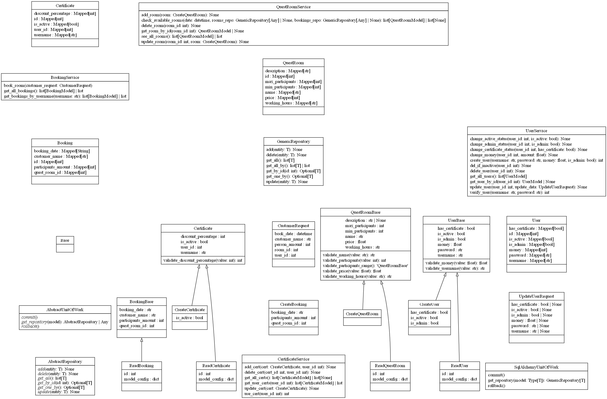

# Лабораторна 4, Варіант 9

## Завдання

Основне в лабораторній роботі – реалізація PL за допомогою WebAPI з демонстрацією роботи
та його ізоляція за допомогою DI.
Правильно реалізований WebAPI дозволяє перевірити коректність програми зовсім без UI.
Достатньо просто в браузері ввести коректну адресу (URI) зі специфічним викликом кожного
контроллера, і відразу в браузері можна побачити результат його роботи. Якщо, наприклад, в
застосуванні є контроллер з методом Get(), який повертає дані (наприклад, всіх собак) і в адресному
рядку браузера ввести “.../api/dogs”, то в самому браузері можна побачити список цих собак. При
використанні інструментів типу Postman, Fiddler GET запити відпрацьовують аналогічним чином. Для
POST, PUT, DELETE запитів необхідно, крім адреси, надати додаткові дані для обробки (наприклад,
об’єкт у відповідному JSON форматі чи id запису, з яким потрібно провести маніпуляції).
DI допоможе використовувати інтерфейси класів нижчого рівня замість створення об’єктів
класів чи, що гірше,- явного виклика конструкторів класів нижчого рівня. Особливості реалізації DI в
PL за допомогою ASP.NET WebAPI чи MVC в тому, що потрібно використовувати спеціальну
інфраструктуру (наприклад, клас NinjectWebCommon).
В лабораторній роботі необхідно виокремити рівень доступу до даних, логіку роботи програми
(бізнес логіку) та рівень представлення, як веб застосування, а також (опціонально) – інтерфейс
користувача.
За необхідності можна додавати нові властивості, сутності та розширювати функціонал. Але ця
необхідність повинна бути обґрунтована.
Для демонстрації роботи програми необхідно підготувати набір вхідних даних.

- Квест-кімната :
Інформація по квест-кімнатах. По кожному квесту – ліміт на
кількість учасників. Реалізувати основний функціонал по пошуку
та бронюванню квесту. Замовити квест можна тільки у вільний
часовий проміжок. При наявності подарункового сертифікату
замовити квест можна безкоштовно.

## Структура лабораторної

```note
+---API
|   |   bookigs.py
|   |   certs.py
|   |   dependencies.py
|   |   quests.py
|   |   users.py
|   |   __init__.py
+---DataAccess
|   |   abstracts.py
|   |   repository.py
|   |   unit_of_work.py
|   |   __init__.py
|   +---DataBase
|   |   |   initDB.py
|   |   |   models.py
|   |   |   schemas.py
|   |   |   __init__.py
|   |   |   
+---postman_quaries
|       Admin Quest Room API.postman_collection.json
|       Public Quest Room Api.postman_collection.json
+---Services
|   |   booking.py
|   |   certificate.py
|   |   quest.py
|   |   user.py
|   |   __init__.py
|   .env
|   .postman
|   admin.py
|   db_config.json
|   main.py
|   output.txt
|   pyproject.toml
|   quest_rooms.db
|   README.md
|   requirements.txt
|   uv.lock
```

- Діаграма класів та їх взаємодії:


## Вимоги до середовища розробки

- python 3.14
- SQLAlchemy 2.0.0 або вище
- fastapi стандартний пак
- SQLite (використовується як СУБД для зберігання даних)

- Під лінукс:

```bash
python3.14 -m venv .venv314
source .venv314/bin/activate
pip install -r requirements.txt
```

- Під Windows:

```powershell
py -3.14 -m venv .venv314
.venv314\Scripts\activate
pip install -r requirements.txt
```

- Запускаємо через:

```bash
fastapi run
```

## Відповіді на контрольні питання

1. **Що таке API? Що таке WebAPI?**
API (Application Programming Interface) — це набір визначених правил та інструментів, за допомогою яких різні програми взаємодіють між собою. WebAPI — це різновид API, розроблений для доступу через мережу Інтернет за допомогою стандартного протоколу HTTP.

2. **Які задачі вирішує та в чому особливості рівня представлення PL?**
Рівень представлення (Presentation Layer) відповідає за взаємодію з клієнтом або інтерфейсом користувача. Його задачі: прийом вхідних запитів, базова валідація даних, передача даних на рівень бізнес-логіки та формування відповіді у відповідному форматі (наприклад, JSON). Головна особливість — він не повинен містити жодної бізнес-логіки чи операцій доступу до бази даних.

3. **Які типові шаблони проектування існують для реалізації рівня представлення PL?**
Найбільш поширеними є шаблони MVC (Model-View-Controller), MVP (Model-View-Presenter) та MVVM (Model-View-ViewModel).

4. **В чому особливість та як реалізується шаблон MVC?**
Шаблон MVC розділяє архітектуру на три частини: Model (дані та логіка), View (відображення) та Controller (обробка запитів). Користувач взаємодіє з Controller, який звертається до Model для обробки даних, після чого передає результати у View для формування інтерфейсу.

5. **В чому особливість та як реалізується шаблон MVP?**
MVP є варіацією MVC, де View є максимально пасивним, а всі рішення щодо взаємодії між View та Model приймає Presenter. View і Model не знають одне про одного, що значно полегшує автоматизоване тестування коду.

6. **В чому особливість та як реалізується шаблон MVVM?**
MVVM використовує механізм двостороннього зв'язування даних (Data Binding). ViewModel адаптує дані з Model для відображення, а будь-які зміни в інтерфейсі (View) автоматично оновлюють стан ViewModel без необхідності писати прямий код обробки подій.

7. **Опишіть та поясність увесь шлях обробки запиту від браузера клієнта до рівня представлення (включно) з використанням шаблону MVC.**
Браузер відправляє HTTP-запит до сервера. Система маршрутизації (Routing) аналізує URL та визначає, який Controller має обробити запит. Controller викликає відповідний метод (Action), отримує або оновлює дані через Model, а потім передає ці дані об'єкту View, який генерує HTML-сторінку (або інший формат) і повертає її як HTTP-відповідь клієнту.

8. **Чим відрізняється ASP.NET MVC та ASP.NET WebAPI?**
ASP.NET MVC орієнтований на генерацію веб-сторінок з інтерфейсом для людини (повертає HTML за допомогою Views). ASP.NET WebAPI призначений для створення REST-сервісів, які працюють з даними (переважно повертають JSON або XML) і призначені для споживання іншими програмами (наприклад, фронтенд фреймворками чи мобільними застосуваннями).

9. **Чим відрізняється WebAPI (як рівень представлення) від усіх інших клієнт-серверних застосувань?**
WebAPI є універсальним сервісом даних, що не має прив'язки до конкретного інтерфейсу користувача. Це дозволяє одному і тому ж WebAPI обслуговувати абсолютно різних клієнтів (веб-сайти, мобільні додатки, десктопні програми, IoT пристрої) за допомогою стандартизованих HTTP-запитів.

10. **Які види серверів ви знаєте?**
До основних видів належать: веб-сервери, сервери баз даних, сервери застосувань (Application Servers), файлові сервери, поштові сервери, проксі-сервери, DNS-сервери.

11. **Що таке веб сервер і які його основні задачі? Наведіть приклади.**
Веб-сервер — це програма (або апаратне забезпечення), що обробляє HTTP-запити від клієнтів і віддає їм контент. Його задачі: маршрутизація запитів, управління з'єднаннями, забезпечення безпеки (HTTPS) та віддача статики. Приклади: Nginx, Apache, IIS.

12. **Що таке сервер застосувань і які його основні задачі? Наведіть приклади.**
Сервер застосувань забезпечує середовище для виконання бізнес-логіки. Його задачі: управління транзакціями, підтримка багатопотоковості, підключення до баз даних, забезпечення життєвого циклу об'єктів. Приклади: Tomcat, JBoss, WebSphere, Kestrel.

13. **Поясніть протокол HTTP та його роботу.**
HTTP (HyperText Transfer Protocol) — це прикладний протокол передачі даних за моделлю "клієнт-сервер". Клієнт формує запит, вказуючи метод, URL, необхідні заголовки та іноді тіло запиту. Сервер обробляє запит і надсилає відповідь, що містить статус-код (результат операції), заголовки та дані. Протокол є "stateless" — не зберігає стан між запитами за замовчуванням.

14. **В чому різниця між основними HTTP методами: get, post, put, delete?**
GET — отримання даних без зміни їхнього стану на сервері. POST — відправлення даних для створення нового ресурсу. PUT — повне оновлення або модифікація існуючого ресурсу за ідентифікатором. DELETE — видалення ресурсу на сервері.

15. **Поясніть основні групи статус кодів HTTP.**
1xx — Інформаційні (запит отримано, обробка триває).
2xx — Успішні (200 OK — операція виконана успішно).
3xx — Перенаправлення (потрібні додаткові дії з боку клієнта).
4xx — Помилки клієнта (400 Bad Request, 404 Not Found — некоректний запит або ресурс не знайдено).
5xx — Помилки сервера (500 Internal Server Error — проблема на стороні сервера).

16. **В чому полягає особливість реалізації DI для ASP.NET MVC чи WebAPI застосувань?**
Особливість у тому, що фреймворк самостійно створює екземпляри контролерів при кожному запиті. Для використання Dependency Injection (DI) необхідно впровадити спеціальні резолвери залежностей (наприклад, через Ninject, Autofac або вбудований DI-контейнер), які перехоплюють процес створення контролера і автоматично підставляють необхідні реалізації інтерфейсів у його конструктор.

17. **Поясніть особливості використання Postman, Fiddler та подібних інструментів.**
Ці інструменти необхідні для розробки та тестування API. Вони дозволяють розробникам вручну створювати складні HTTP-запити (з будь-якими методами, заголовками та JSON-тілом), які складно або неможливо відправити через звичайний адресний рядок браузера, а також детально аналізувати відповіді сервера.

18. **В чому різниця між веб застосуванням та веб сервісом?**
Веб-застосування генерує інтерфейс користувача (HTML/CSS), призначений для взаємодії з людиною через браузер. Веб-сервіс призначений для міжмашинної взаємодії та повертає лише дані (зазвичай JSON або XML), залишаючи відповідальність за відображення на стороні програми-клієнта.

19. **Що таке REST?**
REST (Representational State Transfer) — це архітектурний стиль для проектування розподілених систем, який базується на роботі з ресурсами через стандартизовані методи HTTP (GET, POST, PUT, DELETE), використанні унікальних URL для кожного ресурсу та відсутності збереження стану клієнта на сервері.

20. **В чому відмінність REST від RPC та SOAP?**
SOAP — це важкий протокол на базі XML зі строгими правилами повідомлень. RPC орієнтований на виклик віддалених процедур і функцій. REST є гнучкішим та простішим стилем, який орієнтується не на дії (процедури), а на ресурси (іменники) та їхній стан, використовуючи стандартні механізми вебу.

21. **Як побудована маршутизація в ASP.NET WebAPI та як вона працює?**
Маршрутизація використовує механізм зіставлення вхідного URL з шаблонами. Існує два типи: маршрутизація на основі таблиці маршрутів (Convention-based), де шаблон задається централізовано (наприклад, "api/{controller}/{id}"), та маршрутизація на основі атрибутів (Attribute routing), де шаблон URL прописується безпосередньо над методом за допомогою атрибутів типу [Route("...")].

22. **Як визначається, який контроллер та який метод будуть виконуватися у відповідь на запит?**
При надходженні запиту маршрутизатор розбирає URL. Сегмент "{controller}" вказує на назву класу (наприклад, "dogs" вказує на DogsController). Метод обирається на основі типу HTTP-запиту (GET-запит викличе метод, який починається на "Get" або позначений атрибутом [HttpGet]) та за збігом параметрів у URL з параметрами методу контролера.
